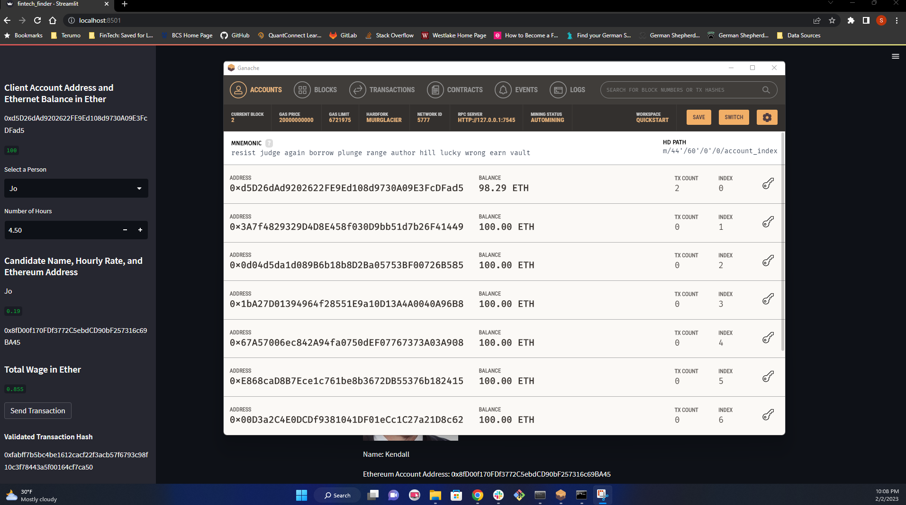
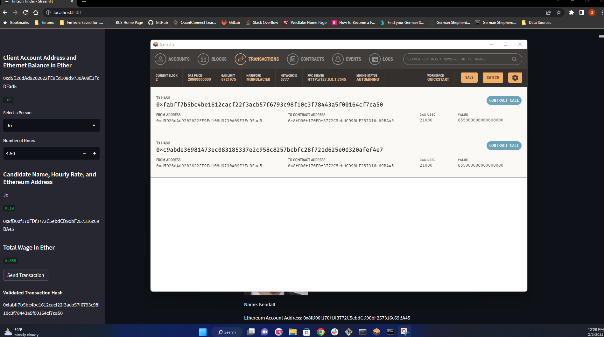

# Module_19_Challenge
Goal: To create a platform called "FinTech Finder" which is an application that customers use to find, hire, and pay fintech professionals (based on their wage rates). This application integrates to the Ethereum network (through Ganache) to instantly pay hired professionals in ETH. This is all possible through a web application created using Streamlit. 

---

## Technologies

This application uses the following programs:  
Python version 3.9.15  
Streamlit version 1.16.0  
Web3 version 5.31.3  

Along with the above program, this application also makes use of Ganache. 

---

## Installation Guide

To check your current Python version, run the following code in your terminal:  
python --version  

To check if the aforementioned packages are installed on your local machine, use the following code: 
pip show streamlit  
pip show web3  

If installation of these packages is required, run the following code:  
pip install pandas   
pip install streamlit  
pip install web3  

If installation of Ganache is required, please visit the Ganache download page:  
https://trufflesuite.com/ganache/  

Note: I am not partnered with, sponsored by, or otherwise affiliated with Ganache in any way.   

---

## Usage

Important: This program is intended purely for academic purposes and is solely an example of what is possible. In its current state, this application is not intended to send live ETH transactions.  

To begin using this program, please download the following files (available in the GitHub repository) to your local machine:  
fintech_finder.py  
crypto_wallet.py  
Images/  

You will also need to create your own .env file to house your Ganache mnemonic (provided by your Ganache instance). After downloading Ganache, launch Ganache, click on "Quickstart", and copy your mnemonic into your .env file. Be sure to map your .env file to the crypto_wallet.py file.   

Launch your terminal and navigate to the folder housing the .py files. In your terminal, input the following code to begin using the FinTech Finder application:  
streamlit run fintech_finder.py  

---

## Visual Examples

Updated balance of Ganache accounts after submitting transactions:  
  

Proof of verified transaction history:  

---

## Contributors

Shahrukh Alam

---

## License

Columbia Engineering: FinTech Bootcamp